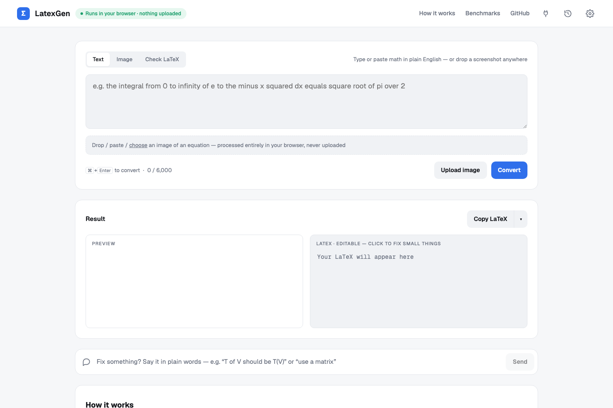
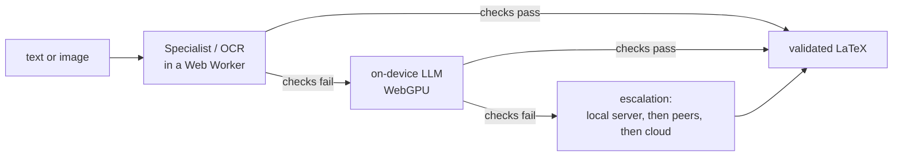

<p align="center">
  
</p>

<h1 align="center">LatexGen</h1>

<p align="center">
  Plain-English math and equation screenshots to validated LaTeX.<br>
  Runs in your browser. Free, unlimited, private.
</p>

<p align="center">
  <a href="docs/architecture.md">Architecture</a> ·
  <a href="docs/benchmarks.md">Benchmarks</a> ·
  <a href="docs/api.md">Tab API</a> ·
  <a href="docs/mesh.md">Compute mesh</a> ·
  <a href="docs/deploy.md">Deploy</a> ·
  <a href="public/privacy.html">Privacy</a>
</p>

---

Type *"the integral from 0 to infinity of e to the minus x squared"* and get rendered, checked LaTeX back in well under a second. Paste a screenshot of an equation and get the same. The models run inside the tab, so nothing you type or paste is uploaded.

## Why it is different

- **On-device first.** A 220M specialist model answers most equations in about 0.3 s on WebGPU (about 1 s on CPU, so phones and Firefox work too). Bigger inputs use an on-device language model chosen for your machine. Nothing leaves the device.
- **It checks its own work.** Every result must parse in KaTeX and must contain the numbers and concepts you named. Failures trigger a repair with the exact error list, then escalation to a stronger tier. A strict mode adds a second-model review.
- **Every decision is measured.** Which model handles which input, which precision runs on which hardware, which OCR model reads which image: all of it comes from benchmarks in this repo, and you can rerun them.
- **The tab is an API.** Turn on the Tab API and curl, Postman, Shortcuts or Zapier can send work to your open tab, which answers with the models it has loaded, in the background.
- **Tabs help each other.** Opt into the compute mesh and your tab serves other users' overflow while yours can use theirs, governed by a good-faith rule the relay enforces. Text only, validated like every other tier.
- **Free without limits, by design.** You bring the compute, so there is nothing to meter. A server tier exists for what the browser cannot finish; it is provider-agnostic and optional.

## Use it

Open the site, type or paste, press Convert (or Cmd+Enter). Drop or paste an image for OCR. Edit the LaTeX directly, or tell the Refine box what to change in plain words. Copy as LaTeX, display or inline math, MathML (pastes as a live equation into Word and Google Docs), PNG, or open in Overleaf. Install it as an app to keep working offline.

Deep links: `?q=your+math` converts on load; `#l=<latex>` opens a shared result; `?consent=quick` skips the first-visit choice.

## Run it yourself

```bash
docker compose up --build   # http://localhost:8013
```

Add [Ollama](https://ollama.com) or any OpenAI-compatible API (OpenRouter, OpenAI, Groq, a local MLX or vLLM server) for the server tier; see [docs/deploy.md](docs/deploy.md) for configuration, the one-command AWS deployment, and what is hardened for production.

```bash
npm test                     # validator unit tests + server integration tests
```

## How it works, briefly



The full ladder, the validation and repair rules, and the runtime choices are in [docs/architecture.md](docs/architecture.md). The numbers behind them are in [docs/benchmarks.md](docs/benchmarks.md).

## Models and credits

- [IntelliTeX](https://huggingface.co/duanxianpi/IntelliTex), the text specialist, trained on [MathBridge](https://huggingface.co/datasets/Kyudan/MathBridge)
- [Texo / FormulaNet](https://github.com/alephpi/Texo) and [Texify](https://github.com/VikParuchuri/texify) (via [Xenova/texify](https://huggingface.co/Xenova/texify)) for images
- Qwen3 models through [WebLLM](https://github.com/mlc-ai/web-llm); [transformers.js](https://github.com/huggingface/transformers.js) and ONNX Runtime Web; [KaTeX](https://katex.org); [MathLive](https://cortexjs.io/mathlive/)

## Status

Working and self-hostable today; AWS deployment scripted; license to be decided. Issues and ideas welcome.
