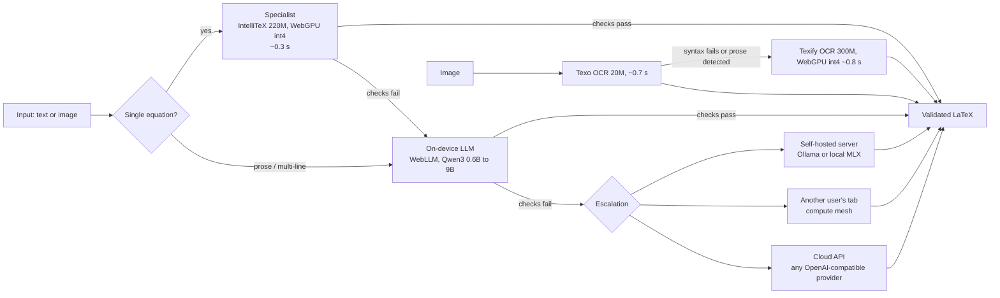

# Architecture

LatexGen converts plain-English math and equation screenshots to LaTeX with models that run in the browser. A conversion walks a ladder of tiers and only climbs when the previous tier's output fails validation.



## Tiers

1. **Specialist.** [IntelliTeX](https://huggingface.co/duanxianpi/IntelliTex) (CodeT5+ 220M) fine-tuned on plain-English to LaTeX pairs. Runs on transformers.js in a Web Worker, WebGPU int4 when available and CPU int8 otherwise. Handles single-line inputs up to 320 characters, including lists of equations one per line (each line converted separately).
2. **On-device language model.** WebLLM runs a Qwen3-family model on WebGPU. A progressive ladder loads the small model within seconds and swaps in the best model the device can hold, measured against the GPU budget and browser storage quota. Prompts are kept terse because prefill dominates short generations on laptop GPUs.
3. **Escalation.** Ordered by trust and cost: a self-hosted local server first, then other users' tabs (the mesh), then a cloud API. The client learns the order from the server's `serverKind`.

Images go through their own two-model ladder: Texo first (tiny, fast, robust to small fonts and dark backgrounds), Texify when Texo's output fails syntax checks or it spelled out prose, which it has no mode for.

## Validation and repair

Every output passes two checks: KaTeX must parse every math segment, and the numbers and named concepts in the input must appear in the LaTeX. On failure the model that produced the output gets one repair turn with the exact error list (up to five while the error keeps changing, when no server is available); if that fails, the ladder escalates. Refinements requested by the user are accepted only if they are LaTeX: no echo of the instruction, must parse, no new prose outside math.

Strict mode adds a second model that judges whether the LaTeX says what the text says. It runs after the result is on screen and offers a fix if it disagrees.

## Runtime

- ONNX models (IntelliTeX, Texo, Texify) run in `onnx-worker.js`; WebLLM runs in `webllm-worker.js`. The page never blocks on inference.
- WebGPU int4 is used where the runtime benchmark showed a win (specialist 1.28 s to 0.45 s, Texify 8.0 s to 0.81 s, identical outputs). int4 on CPU is ten times slower than int8, so it is GPU-only. A failed WebGPU session is remembered per model and CPU is used on the next load.
- Texo does not run on ONNX Runtime when WebNN is present: `texo-webnn.js` replays hand-built WebNN graphs from the graph catalog (`webnn-catalog`, family `texo-384`, vendored loader under `vendor/webnn-catalog/`, entry files and constants under `models/texo-webnn/`). 0.77 s becomes about 20 to 30 ms per image with identical output. Only the Core ML backend is accepted (Chromium's silent TFLite CPU fallback is 50x slower); a rejected or failed WebNN load is remembered per model like a failed WebGPU session, and the ONNX Runtime CPU fp32 path is used from then on. Safari, Firefox and un-flagged Chrome behave exactly as before.
- All conversion logic lives in `pipeline.js`, with no DOM access. The UI, the Tab API and mesh jobs call the same functions.

## Files

```
public/app.js          UI wiring: drawers, model picker, ladder, Tab API client
public/pipeline.js     headless conversion ladder (UI, Tab API and mesh share it)
public/models.js       main-thread client for the ONNX worker, runtime selection
public/onnx-worker.js  IntelliTeX, Texo, Texify inference
public/texo-webnn.js   Texo through the graph catalog's WebNN recipes (Core ML)
public/vendor/webnn-catalog/  the catalog's runtime loader, pinned (VERSION)
public/models/texo-webnn/     the catalog entry: recipes, manifest, tokenizer, constants
public/webllm-worker.js WebLLM engine host
public/validator.js    KaTeX syntax and input-fidelity checks
public/vendor/         pinned local copies of every library and font
public/models/         ONNX weights (git-lfs for int8/fp32; int4 built by scripts/build-model-variants.sh)
server.js              zero-dependency Node server: static files, server-model proxy, relay
```
