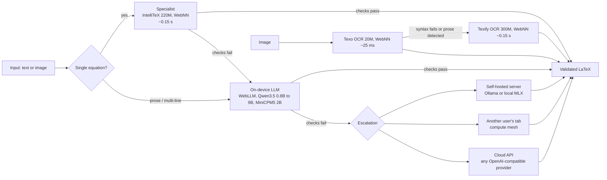

# Architecture

LatexGen converts plain-English math and equation screenshots to LaTeX with models that run in the browser. A conversion walks a ladder of tiers and only climbs when the previous tier's output fails validation.



## Tiers

1. **Specialist.** [IntelliTeX](https://huggingface.co/duanxianpi/IntelliTex) (CodeT5+ 220M) fine-tuned on plain-English to LaTeX pairs. Runs in a Web Worker: hand-built WebNN graphs from the graph catalog (`intellitex-t5-220m`) when Core ML is present, WebGPU int4 when available otherwise, and CPU int8 as the last fallback. Handles single-line inputs up to 320 characters, including lists of equations one per line (each line converted separately).
2. **On-device language model.** WebLLM runs a small model on WebGPU: Qwen3.5 0.8B, MiniCPM5 2B, Qwen3.5 4B or Qwen3.5 9B, picked by the tier-matched benchmark in [benchmarks.md](benchmarks.md), where each replaced the Qwen3 size it succeeds on prose passages and PDF pastes. MiniCPM5 2B has no upstream WebLLM build, so this project quantized and compiled it and hosts it at [ozhyhinas/MiniCPM5-2B-q4f16_1-MLC](https://huggingface.co/ozhyhinas/MiniCPM5-2B-q4f16_1-MLC); `app.js` merges that record into WebLLM's prebuilt list (`PUBLISHED`). A progressive ladder loads the small model within seconds and swaps in the best model the device can hold, measured against the GPU budget and browser storage quota. Prompts are kept terse because prefill dominates short generations on laptop GPUs. On an Apple GPU with WGSL subgroups behind Chromium 152 or newer, the graph catalog's patched WebLLM runtime (family `qwen3-webllm`) replaces stock decoding with device-resident greedy argmax and batched command encoding, decoding noticeably faster at temperature 0; the catalog currently carries tuned model libs for the Qwen3 sizes only, so the Qwen3.5 ladder runs stock WebLLM until Qwen3.5 libs are compiled. Anywhere else, or if that runtime fails to load, it falls back to stock WebLLM.
3. **Escalation.** Ordered by trust and cost: a self-hosted local server first, then other users' tabs (the mesh), then a cloud API. The client learns the order from the server's `serverKind`.

Images go through their own two-model ladder: Texo first (tiny, fast, robust to small fonts and dark backgrounds), Texify when Texo's output fails syntax checks or it spelled out prose, which it has no mode for.

## Validation and repair

Every output passes two checks: KaTeX must parse every math segment, and the numbers and named concepts in the input must appear in the LaTeX. On failure the model that produced the output gets one repair turn with the exact error list (up to five while the error keeps changing, when no server is available); if that fails, the ladder escalates. Refinements requested by the user are accepted only if they are LaTeX: no echo of the instruction, must parse, no new prose outside math.

Strict mode adds a second model that judges whether the LaTeX says what the text says. It runs after the result is on screen and offers a fix if it disagrees.

## Runtime

- ONNX models (IntelliTeX, Texo, Texify) run in `onnx-worker.js`; WebLLM runs in `webllm-worker.js`. The page never blocks on inference.
- WebGPU int4 is used where the runtime benchmark showed a win (specialist 1.28 s to 0.45 s, Texify 8.0 s to 0.81 s, identical outputs). int4 on CPU is ten times slower than int8, so it is GPU-only. A failed WebGPU session is remembered per model and CPU is used on the next load.
- Texo, Texify and IntelliTeX do not run on ONNX Runtime when WebNN is present: `texo-webnn.js` / `texify-webnn.js` / `intellitex-webnn.js` replay hand-built WebNN graphs from the graph catalog (families `texo-384`, `texify-420` and `intellitex-t5-220m`, vendored loader under `vendor/webnn-catalog/`). Texo goes from 0.77 s to about 20 to 30 ms per image; Texify from 0.81 s to about 0.15 s; IntelliTeX from 0.45 s to about 0.15 s, all with identical greedy output. Only the Core ML backend is accepted (Chromium's silent TFLite CPU fallback is 50x slower). A rejected or failed WebNN load is remembered per model: Texo falls back to CPU fp32, Texify and IntelliTeX to WebGPU int4. Safari, Firefox and un-flagged Chrome behave exactly as before.
- WebLLM does not run its stock decoding path when the graph catalog's runtime applies: `qwen3-webllm.js` picks one of three patched WebLLM 0.2.84 bundles (vendored under `vendor/webllm/`, family `qwen3-webllm`) plus a per-model TVM model lib streamed straight from the catalog dataset; the model weights are the stock `mlc-ai` q4f16_1 shards, shared with the stock path, so only the runtime bundle and the model lib differ. The fast path (device-resident greedy argmax, K-token decode bursts, batched command encoding with periodic flushes, optional lookahead) only engages at `temperature: 0` with no `logprobs`, which is also why `pipeline.js` now decodes greedily. The target probe requires an Apple GPU adapter exposing the `subgroups` feature on Chromium 152 or newer; a failed probe or a failed engine load falls back to stock WebLLM and is remembered per model for 7 days, so a transient failure does not pin stock forever. `?webllm=stock` and `?webllm=catalog[:variant]` override the pick for benchmarking.
- All conversion logic lives in `pipeline.js`, with no DOM access. The UI, the Tab API and mesh jobs call the same functions.

## Files

```
public/app.js          UI wiring: drawers, model picker, ladder, Tab API client
public/pipeline.js     headless conversion ladder (UI, Tab API and mesh share it)
public/models.js       main-thread client for the ONNX worker, runtime selection
public/onnx-worker.js  IntelliTeX, Texo, Texify inference
public/texo-webnn.js   Texo through the graph catalog's WebNN recipes (Core ML)
public/texify-webnn.js Texify through the graph catalog's WebNN recipes (Core ML)
public/intellitex-webnn.js IntelliTeX through the graph catalog's WebNN recipes (Core ML)
public/vendor/webnn-catalog/  the catalog's runtime loader, pinned (VERSION)
public/models/texo-webnn/     Texo catalog entry: recipes, manifest, tokenizer, constants
public/models/texify-webnn/   Texify catalog entry: recipes, manifest, constants
public/models/intellitex-webnn/ IntelliTeX catalog entry: recipes, manifest, tokenizer
public/webllm-worker.js WebLLM engine host
public/qwen3-webllm.js  qwen3-webllm catalog runtime: probe, plan, per-model stock fallback
public/bench-webllm.js  head-to-head bench: stock WebLLM vs the catalog's patched runtimes (bench-webllm.html)
public/validator.js    KaTeX syntax and input-fidelity checks
public/vendor/         pinned local copies of every library and font
public/vendor/webllm/  stock WebLLM bundle (index.js) plus the catalog's three patched builds (web-llm-0.2.84-qwen-m5.js, -m5-overlap.js, -m5-lookahead.js)
public/models/         ONNX weights (git-lfs for int8/fp32; int4 built by scripts/build-model-variants.sh)
public/models/qwen3-webllm/  Qwen3 catalog entry: runtime bundles, model libs and tuning hooks (catalog.json)
server.js              zero-dependency Node server: static files, server-model proxy, relay
```
